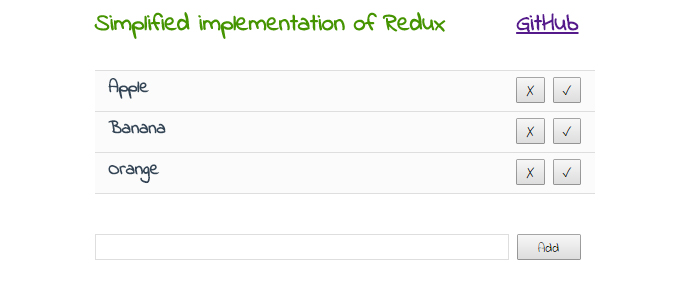

# tinyRedux


The tinyRedux library is an simplified version of Redux which provides the same capabilities.

## Demo
https://frentsel.github.io/tinyRedux/index.html

## Download
**CDN:** https://cdn.rawgit.com/frentsel/tinyRedux/master/tinyRedux.js

## Basic Usage

Create some data store for application
```javascript
var data = [
    'Apple',
    'Banana',
    'Orange'
];
```

Pass created data and object of handlers into Store constructor fro create instance of store.
```javascript
var store = new Store(data, {
    GET_ALL: function (state) {
        return state;
    },
    ADD: function (state, item) {
        state.push(item);
        return state;
    },
    DELETE: function (state, item) {
        var index = state.indexOf(item);
        state.splice(index, 1);
        return state;
    },
    UPDATE: function (state, obj) {
        var index = state.indexOf(obj.from);
        state[index] = obj.to;
        return state;
    }
});
```

Subscribe on all changes of state.
```javascript
store.subscribe(function(state){
	console.log(state);
});
```

And let's change a storage.
```javascript
store.dispatch('GET_ALL');
store.dispatch('ADD', 'Melon');
store.dispatch('DELETE', 'Orange');
store.dispatch('UPDATE', {from: 'Orange', to: 'Peach'});
```
